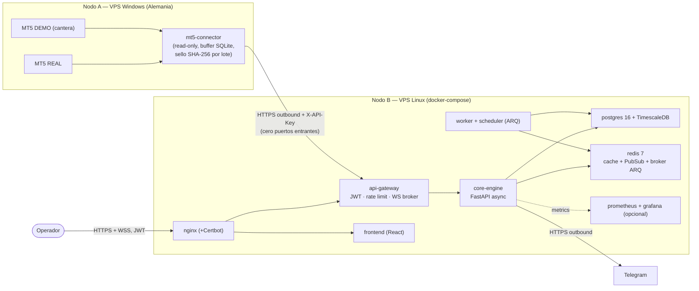

# Arquitectura — StratOS-QXPro

Topología de 2 nodos (PARTE 3 del prompt maestro). El paquete `MetaTrader5` solo funciona en Windows con terminal instalado; Wine queda fuera de scope.

Reglas de esta topología (P1–P15):
- El conector SOLO inicia conexión saliente hacia el gateway; nunca hay puertos entrantes en el VPS Windows.
- El conector es estrictamente read-only: nunca envía órdenes a MT5 (P4).
- El frontend solo habla con `api-gateway` (P15.5); `api-gateway` es el único punto de entrada JWT + WS hacia `core-engine`.
- `core-engine` es el único lugar con lógica de dominio (semáforos, kill-switch, pipeline, fórmulas); `api-gateway` no tiene reglas de negocio, el conector no tiene reglas de negocio.

La topología está implementada: `core-engine`, `api-gateway`, frontend, worker/scheduler y el conector/simulador se construyeron en G1–G9 y los huecos de negocio de G10 están cerrados. Ni G11, ni G12, ni G13 cambian la separación de responsabilidades. G11 añadió trazabilidad local de datos, determinismo de fixtures y un reporter read-only. G12 y G13 se limitan a instanciar la misma topología en proyectos Docker aislados —`stratos_g12` y `stratos_operational`, con volumen, red y puertos propios— y a añadir scripts administrativos fuera del camino de la aplicación: la lógica de negocio sigue viviendo sólo en `core-engine`, el conector sigue siendo read-only y el gateway sigue sin dominio.
